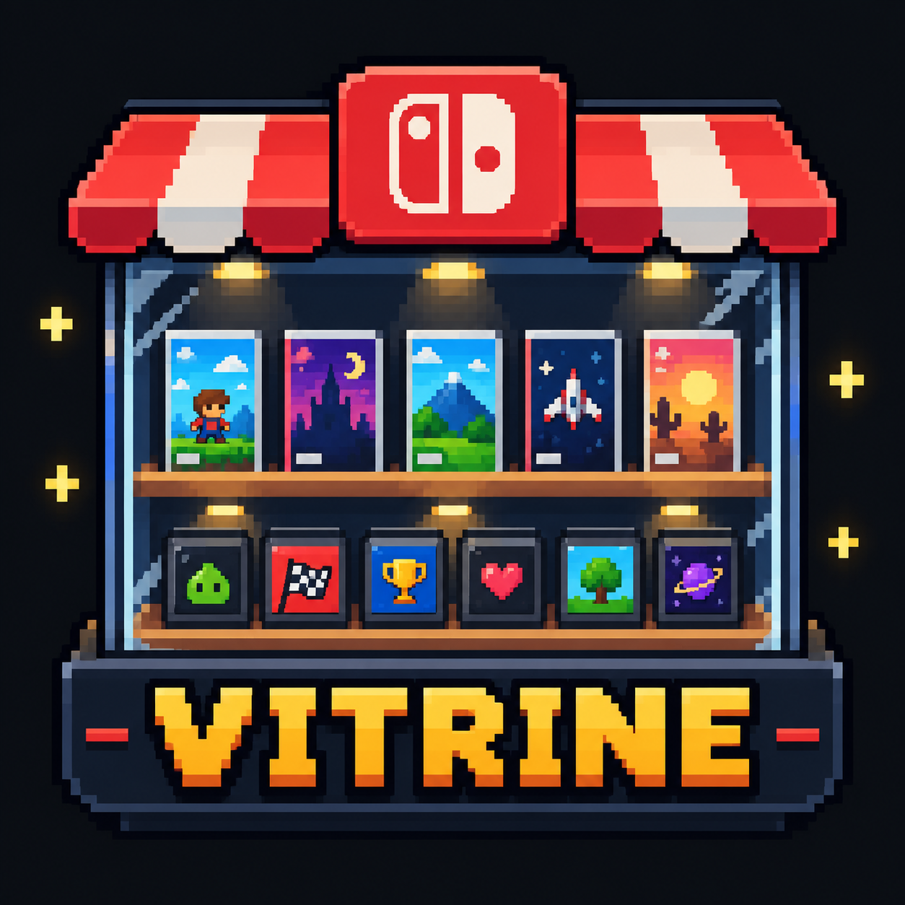

# Switch Vitrine

<p align="center">
  
</p>

<p align="center">
  <strong>Um applet homebrew moderno e fluido para descoberta de jogos no Nintendo Switch.</strong>
</p>

<p align="center">
  
  
  
  
</p>

---

> [!IMPORTANT]
> **Aviso Legal:** O Switch Vitrine é exclusivamente um catálogo informativo e interativo para navegar, pesquisar, consultar notas e gerenciar sua lista pessoal de jogos. **Ele NÃO baixa, instala, distribui nem executa jogos.**

---

## ✨ Funcionalidades

- **Design Elegante e Foco na Arte**: Grade com 5 capas verticais, foco ciano em camadas, animações suaves e um painel contextual com imagem, sinopse, nota e ações do jogo selecionado.
- **Controles de Leitura Rápida**: Atalhos do rodapé e do painel contextual usam teclas visuais inspiradas nos controles do Nintendo Switch.
- **Visualização Alternativa (Modo Clássico)**: Alterne a qualquer momento para a visualização em lista/cards detalhados pressionando o analógico direito (`R3`).
- **Descoberta Inteligente**: Navegue por seções organizadas na aba inicial:
  - *Todos*: Catálogo completo filtrável.
  - *Populares*: Títulos em destaque no momento.
  - *Lançamentos*: Datas oficiais para Nintendo Switch.
  - *Bem avaliados*: Jogos com nota crítica agregada 80+ e amostragem consistente.
  - *Indies*: O melhor da cena independente.
  - *Joias escondidas*: Curadoria de alta pontuação e menor exposição comercial.
- **Filtros e Ordenação Avançada**: Filtragem por gênero, tema e múltiplos modos de ordenação (Maior score, Mais populares, A-Z, Mais curtos e Lançamentos).
- **Ficha Editorial Completa**: Detalhes com desenvolvedora, publicadora, tempo de jogo estimado para créditos e 100%, classificação indicativa, modos de jogo, perspectivas e franquias.
- **Galeria de Screenshots**: Até 6 capturas de tela por jogo carregadas em segundo plano, com suporte a visualização em tela cheia.
- **Minha Lista (Backlog Persistente)**: Acompanhe seu progresso categorizando jogos como *Quero jogar*, *Jogando*, *Finalizado* ou *Abandonado*, com indicadores diretos na grade.
- **Aba de Favoritos**: Acesso rápido à sua seleção pessoal independente de conexão com a internet.
- **Surpreenda-me**: Sorteio aleatório de títulos respeitando os filtros e abas ativas.
- **Busca Rápida**: Integração nativa com o teclado virtual oficial do Switch.
- **Modo Touch**: Navegação direta pela tela portátil com arrasto contínuo da grade, toque em abas, filtros, capas, ações e modais. O primeiro toque em uma capa revela o resumo; o segundo abre os detalhes.
- **Desempenho e Cache Offline**: Sistema de fila de downloads não bloqueante para capas e capturas, com persistência local no cartão SD, limite de 100 MiB e remoção automática dos arquivos menos usados.
- **Atualizações Seguras**: Verificação automática de novas versões no GitHub, confirmação antes de instalar, validação SHA-256 e backup do NRO anterior.

---

## 🎮 Controles

| Comando | Ação |
| :--- | :--- |
| **Direcional / Analógico** | Navegar entre as capas / opções |
| **A** | Abrir detalhes do jogo selecionado / Confirmar |
| **B** | Voltar / Fechar tela de detalhes |
| **X** | Abrir painel de filtros |
| **Y** | Abrir pesquisa por texto (na Home) / Buscar jogos semelhantes (nos Detalhes) |
| **L / R** | Alternar entre as abas (*Explorar*, *Minha lista*, *Favoritos*) ou categorias de filtros |
| **ZL** | **Surpreenda-me** (sortear jogo com base nos filtros) |
| **ZR** | Alterar status no backlog (*Minha lista*) |
| **L3 (Pressionar Analógico Esquerdo)** | Adicionar / Remover dos Favoritos |
| **R3 (Pressionar Analógico Direito)** | Alternar entre visualização de **Capas** e **Modo Clássico** |
| **- (Menos)** | Abrir tela *Sobre*, checagem de conexão e manutenção de cache |
| **+ (Mais)** | Sair do aplicativo |
| **Touch** | Arrastar para rolar a grade; tocar uma vez para ver o resumo e novamente para abrir; deslizar nas screenshots |

---

## 📦 Instalação

1. Acesse a aba de **Releases** do projeto e baixe a versão mais recente do arquivo `switch-vitrine.nro`.
2. Insira o cartão micro SD do seu Nintendo Switch no computador.
3. Copie o arquivo `switch-vitrine.nro` para a pasta:
   ```text
   /switch/switch-vitrine/switch-vitrine.nro
   ```
4. Insira o cartão SD de volta no console e inicie o aplicativo pelo **Homebrew Menu**.

> [!TIP]
> Para obter a melhor performance e garantir que o app tenha acesso a toda a memória RAM disponível, inicie o Homebrew Menu através de **Title Override** (segurando o botão `R` ao abrir qualquer jogo instalado) em vez do modo Applet via Álbum.

---

## 🛠️ Como Compilar

### Pré-requisitos
Certifique-se de ter o ambiente [devkitPro](https://devkitpro.org/) instalado e configurado com a toolchain do Nintendo Switch (`devkitA64`).

Instale as dependências necessárias via `dkp-pacman`:
```bash
dkp-pacman -S switch-dev switch-sdl2 switch-sdl2_ttf switch-sdl2_image \
  switch-freetype switch-curl switch-jansson
```

### Compilação do App (.nro)
No terminal do devkitPro (MSYS2):
```bash
make
```
O arquivo gerado será `switch-vitrine.nro` na raiz do repositório.

### Builds automáticas e releases

O GitHub Actions compila o NRO em cada push e pull request usando o ambiente
oficial do devkitPro. Para publicar uma release, atualize o arquivo `VERSION`,
faça o commit e crie uma tag com a mesma versão:

```bash
git tag v1.0.0
git push origin v1.0.0
```

O workflow publica automaticamente o NRO, o SHA-256 e um ZIP pronto para ser
extraído na raiz do cartão SD. O Vitrine consulta apenas releases estáveis e
sempre pede confirmação antes de instalar uma atualização.

Para testar o auto-updater sem publicar outra release, abra **Actions → Build
Nintendo Switch NRO → Run workflow**, preencha `version_override` com uma versão
anterior, como `0.9.0`, e baixe o artefato produzido. O pacote de teste é
instalado separadamente em `/switch/vitrine-updater-test/`; ao abri-lo, ele
deve oferecer a release estável atual e nunca substituir a instalação principal.

### Testes da Lógica no PC
A lógica de ordenação, catálogo e modelos pode ser testada localmente em qualquer computador com CMake, sem necessidade de emulador ou SDK do Switch:
```bash
cmake -S . -B build-tests
cmake --build build-tests
ctest --test-dir build-tests --output-on-failure
```

Para também compilar todos os módulos extraídos pela refatoração, instale SDL2,
SDL2_image, SDL2_ttf, libcurl e jansson com metadados para `pkg-config` e execute:

```bash
cmake -S . -B build-desktop -DVITRINE_BUILD_DESKTOP_APP=ON
cmake --build build-desktop
ctest --test-dir build-desktop --output-on-failure
```

---

## 📁 Estrutura do Repositório

```text
├── include/core/         # Estado da aplicação, modelos, catálogo e API
├── include/ui/           # Interfaces dos componentes visuais SDL2
├── source/core/          # Regras da aplicação e integrações
├── source/ui/            # Renderização dos componentes visuais
├── source/main.cpp       # Inicialização e loop principal
├── romfs/                # Recursos embarcados na compilação do NRO (ícones, logos)
├── tests/                # Testes unitários para execução no desktop (CMake)
├── CMakeLists.txt        # Testes portáteis e validação opcional do app desktop
├── Makefile              # Regras de build para Nintendo Switch (devkitPro/libnx)
└── README.md             # Este documento público
```

---

## 🤝 Créditos e Agradecimentos

- Comunidade [devkitPro](https://devkitpro.org/) e [switchbrew](https://github.com/switchbrew/switch-examples) pela toolchain e biblioteca `libnx`.
- Projeto [SDL2](https://www.libsdl.org/) pela base gráfica multiplataforma.
- Dados de catálogo fornecidos via API [IGDB](https://www.igdb.com/).

---

<p align="center">
  Desenvolvido por <strong>Mateus Mendes</strong>
</p>
